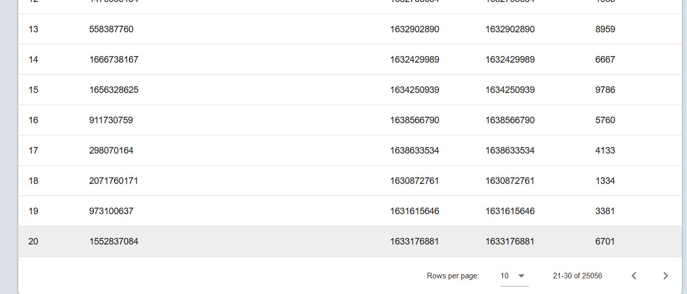

## 系统整体架构
### MVC模式
本系统采用**MVC模式**设计前端-后端-数据库分离的三层整体设计，以保证系统具有较好的**可维护性**和**可扩展性**。

整体来说，系统架构自顶而下遵顼MVC三层架构设计：
1. View: 视图层，直接与用户交互图新界面，它对应的是系统的*前端*
2. Control: 业务逻辑层，负责接收并处理视图层的输入，并利用数据层间接访问数据，它对应的是系统的*后端*
3. Model: 数据层，直接与数据库交互，并为Control层提供经过封装的数据访问功能的，它对应的是系统的*数据库访问接口*

MVC模式具有多个优势：
- 模块耦合度低：MVC中三层都是通过接口

### 视图层：前端设计

在视图层我们采用基于现代HTML5-CSS3-ES6的技术栈以及前端框架Vue来构建特性丰富的Web2.0用户界面。

在视图层我们采用了基于**MVVM模式**的前端框架Vue.js以及Vue系列套件Vue-VueRouter-Vuex构建驱动*单页应用*。

我们通过复用基于Vue的组件库Vuetify来快速搭建风格统一、外观精美的基于Material Design UI设计的应用界面

我们引入著名的D3.js为数据可视化提供支持。

总的来说，我们主要的前端特性包括：
- 基于Vue-VueRouter-Vuex的MVVM前端模块
- 基于Vuetify组件库的Material Design风格前端界面
- 基于D3.js的数据可视化模块

### 业务逻辑层：后端设计

后端架构采用*微服务*架构，将系统业务构建为可以独立运行、独立测试、独立部署的微服务。

后端接口采用的是*RESTful接口*，将业务接口统一为无状态、标准化、缓存友好的RESTful风格接口。

我们基于RESTful API为系统的后台管理模块构建了一组通用的数据CRUD服务。

后端充当MVC中的Controller，既不直接操作数据库，也不直接渲染HTML页面，而是作为数据服务和M-V的中介模块。

在后端模块我们采用Python的轻量级Web框架Flask来支持基础的路由、HTTP请求响应以及Session。选用Python是快速开发，以及利用Python生态中优秀的数据分析和机器学习模块。

为避免后端代码直接使用SQL访问数据库，我们模仿Django框架构建了简易的ORM引擎，为后端代码提供抽象的、独立于具体数据库产品的数据库访问接口。

我们使用psycopg2库来在Python代码中嵌入并执行SQL语句，从而与OpenGauss数据库交互。

总结，我们的后端主要支持这些主要特性：
- 基于Flask的RESTful API
- RESTful数据管理CRUD服务
- 论坛基础功能服务
- 机器学习服务
- 数据分析服务
- 登录服务
- 简易ORM引擎
- 基于线程池的会话


### 数据库设计

数据建模以及数据库的逻辑设计已经在前面章节完成了，这里不再赘述。

在数据库产品选择上，我们使用的产品是OpenGauss。由于系统没有大规模、高可用的需求，我们没有采用数据库产品的复制特性以及集群。

为满足业务需要，我们在数据库服务端编程的*触发器*特新来实现自动的Tag访问日志纪录

出于性能的考虑，做了如下额外工作：
- 为所有unique列建立B树索引
- 基于Web应用读多写少的应用背景，我们对频繁执行的若干个连接查询建立物化视图

## 前端设计

### 基于Vue.js系列工具的前端模块

在前端设计中，我们采用基于现代HTML5-CSS3-ES6的技术栈以及前端框架Vue来构建特性丰富的Web2.0用户界面。

我们采用了基于**MVVM模式**的前端框架Vue.js以及Vue系列套件Vue-VueRouter-Vuex构建驱动*单页应用*。

单页应用意味着**前端模块很容易迁移为桌面应用、手机App以及小程序**，这正是本项目较好的可扩展性的重要体现。

Vue的核心特性是数据绑定以及配套的响应式渲染。通过将界面和与前端代码逻辑分离实现前端组件的*可复用性、可维护性和可扩展性*。在Vue框架中，Javascript代码基于不需要直接访问和操作DOM元素。借助Vue框架的数据绑定特性，Javascript直接操作数据，由框架响应式地将数据渲染为界面。此外，Vue将一个UI的结构、样式和逻辑封装起来，实现了前端UI组件的复用。本项目通过复用Vuetify组件库来构件界面。

Vue Router是实现Vue单页应用的关键部件，它利用路由匹配和组件切换实现不刷新整个页面、不向服务端重新请求整个页面的情况下的“页面”切换。通过将页面聚合到一个HTML文档中，Vue Router实现了“单页应用”，具备了将同一个前端项目输出为桌面应用、手机App、微信小程序的基础。

Vuex是配合Vue Router实现单页应用中跨组件状态维护的库。相比直接使用绑定`window`的全局变量，Vuex提供的状态模块可以完美嵌入Vue框架，提供响应式渲染的特性。本项目的前端登录模块以及用户登录状态的记录特性采用Vuex实现。通过在Vuex中存储当前用户的信息以及session token实现各个页面组件间记录当前登录用户的特性。


### 应用界面：基于Vuetify组件库

我们通过复用基于Vue的组件库Vuetify来快速搭建风格统一、外观精美的基于Material Design UI设计的应用界面。本项目复用了大量Vuetify组件来实现丰富的表单界面（日期选择器、文本框、选择栏）。

以下展示部分应用界面。完整界面参见附录和演示视频：

帖子列表：


发帖界面：


个人信息中心：


数据管理界面：


服务端分页：



告示信息：


日期选择组件：


### 响应式设计

响应式设计：利用CSS3媒介查询，自适应地根据手机、平板、PC屏幕的特点调整网页布局，从而生成跨媒介风格统一的界面的前端设计技术。

本项目基于Vuetify组件库的响应式栅格系统构建了跨手机-PC支持的应用界面。


### D3.js数据可视化

我们引入著名的D3.js为数据可视化提供支持。

D3.js是以数据为中心的可视化库，它提供从原始数据到图标信息的数据绑定，最终渲染基于SVG。

本项目利用D3.js实现情感分类模块和热度统计模块的图表可视化。


### 数据管理后台前端模块

我们为本项目的数据管理后台构建了通用数据编辑组件`ObjectListEditor`和编辑表单组件`DialogEditor`实现**任意模型的数据对象的编辑的通用列表和通用表**。这个模块需要额外的后端服务支持。

数据管理界面：


右侧是数据对象模型列表，每个模型对应一个数据库的表。利用模型包含的元数据，前端可以自动选择适当的组件构造数据列表和表单：

告示信息：


新建对象表单：


日期选择组件：


## 后端技术选型
- 选择Python作为后端开发语言的原因
  - 快速开发与快速迭代
  - “胶水语言”，与多种编程语言具有良好的互操作性
  - 与机器学习算法无缝衔接
  - 具备丰富的数据分析工具
- 选择Flask的原因：
  - 轻量：Flask只包含了基本的HTTP请求/响应解析和路由映射模块
  - 功能齐全：具备了动态路由映射、基于cookie-session的客户端状态、鉴权、JSON序列化、模板等基本功能
  - 高度定制：为了符合本项目作业要求，我们需要自己开发数据库连接的部分。相比Django绑定数据库连接模块，Flask可以自由替换。
## 后端数据访问抽象

出于以下原因，我们不希望直接在后端业务代码中编写SQL语句：
1. 可维护性：直接使用SQL的后端代码中，业务处理逻辑和数据存取逻辑是混杂在一起的，增大了系统维护难度和软件复杂度。
2. 可扩展性：
   - 若直接编写SQL语句，后端业务代码将与**特定的SQL数据库产品绑定**，难以迁移到其他数据库产品上。
   - 若直接编写SQL语句，将限制后端将来**迁移到NoSQL数据库上的可能性**。
3. 安全性：直接使用字符串模板构造SQL代码容易出现*SQL注入漏洞*。使用间接操作允许我们灵活地添加验证/转义处理。
4. 易用性：标准数据库接口的返回都是元组，将元组绑定到一定的对象上更便于业务逻辑层的代码使用
5. 自省能力：直接使用数据库接口比较难获取表的元数据，难以产生灵活的前端模块


综上，我们需要为后端代码提供适当的数据访问抽象。

我们模仿Django构建了一个简易的**ORM引擎**作为这一抽象。


### ORM引擎：抽象的数据库访问接口

对象关系映射（英语：Object Relational Mapping），是一种程序设计技术，用于实现面向对象编程语言里不同类型系统的数据之间的转换。从效果上说，它其实是创建了一个可在编程语言里使用的“虚拟对象数据库”。

本项目设计的简易ORM库（以下简称ORM）是后端代码的抽象的数据库访问接口。

FHORM支持如下主要特性：
- 基于Python元类的对象-关系映射模型定义语法
- `select, insert, update, delete`操作
- 可替换的数据库后端
- 基于运算符重载的便捷查询条件书写
- 透明的线程池使用
- 支持快速模型元数据

### 模型元数据服务：通用视图支持
为了实现ORM高度灵活、自省的特性，我们引进了*Python元类*的高级特性来实现代码：

ORM的核心类有如下三个：
- `Field`
  
  代表关系型数据库中表的“列”的对象的基类。ORM预定义了大量的`Field`来表示
  许多数据库的类型比如`CharField`, `IntegerField`, `BlobField`。

  完整的Field列表详见源代码。

- `Model`
  
  用于描述关系数据库中元组到Python对象的映射的基类。

  定义映射时需要将适当类型的`Field`绑定到适当的属性名上，需要与数据库中的表意义对应。

  Model的实例就是表示一个具体的数据对象，通常是有数据库中的一行映射而来的。

- `ModelMetaClass`
  
  **自定义的元类，作为`Model`类的元类**。它负责自动在Class本身构造（代码启动）的阶段收集Model的类成员属性，从而实现透明地使用Model的元数据的目的。

以下是一则使用ORM定义映射模型的例子（摘自本项目）：
```python
class Post(Model):
    __tablename__ = 'post'
    pid = AutoField(primary_key=True,label="PID")
    hot_value = IntegerField(label="Hot Value")
    title = CharField(label="Title")
    content = TextField(label="Content")
    post_time = DatetimeField(label="Post Time")
    last_modified_time = DatetimeField(label="Last Modified")
    poster_uid = ForeignField(ForumUser, label="Poster UID")
```


`ModelMetaClass`的实现：
```python
class ModelMetaClass(type):
    '''
    Meta class for Model

    Mainly works to generate meta info from model definition
    '''
    def __new__(cls, cls_name, cls_bases, cls_attrs):
        # collect fields and setup descriptors
        pk = []
        default = {}
        fields_info = []
        fields_name = []
        for idx, (attr_name, attr) in enumerate(cls_attrs.items()):
            if issubclass(type(attr), Field):
                attr.name = attr_name
                
                info = attr.get_info()
                info['idx'] = idx
                info['name'] = attr_name
                fields_info.append(info)
                fields_name.append(attr_name)
                if attr.primary_key:
                    pk.append(attr_name)
                if hasattr(attr, 'default'):
                    default[attr_name] = attr.default
        cls_attrs['__fields__'] = tuple(fields_name)
        cls_attrs['__default__'] = default
        cls_attrs['__model_info__'] = {
            'pk': pk,
            'fields': fields_info,
            'default': default,
        }

        # handle primary key
        if cls_name != 'Model' and not pk:
            raise ORMError('No primary key specified.')
        cls_attrs['__pk__'] = tuple(pk)

        # set table name
        cls_attrs.setdefault('__tablename__', cls_name)

        model = super().__new__(cls, cls_name, cls_bases, cls_attrs)
        for attr in cls_attrs.values():
            if issubclass(type(attr), Field):
                attr.model = model
        return model
```

### Psycopg2：Python与openGauss数据库通信

openGauss的引擎主体采用的是开源的PostgreSQL的引擎。我们采用PostgreSQL的Python客户端`Psycopg2`包来支持Python和openGauss的通信。

Psycopg2支持一些高级的特性，比如自动将`timestamp`类型转换成数据Python的`datetime`类型

### Engine：可替换的数据库后端

ORM使用一层名为`Engine`的抽象实现可替换的数据库后端。

在ORM中，**通过调用给定Engine的`select, insert, update, delete`方法并传入请求参数来存取数据**。

在Engine中，核心是需要从传入参数构造SQL语句，本项目的实现如下：

```python
def query2sql(query):
        '''
        required:
            - method
            - tablename
        optional:
            - condition
            - agg
            - orderby
            - orderby_desc
            - limit
            - offset
            - join
        '''
        if query['method'] == 'select':
            tpl = 'select {agg_str} from {tablename}'

            agg = query.get('agg')
            if agg is not None:
                agg_str = f'{agg}(*)'
            else:
                agg_str = '*'
            join = query.get('join')
            if join:
                table1 = query['tablename']
                table2 = join['join_model'].__tablename__
                tablename = f"{table1} join {table2} on {table1}.{join['field1']} = {table2}.{join['field2']}"
            else:
                tablename = query['tablename']
            tpl = tpl.format(
                tablename=tablename,
                agg_str=agg_str
            )

            condition = query.get('condition')

            if condition:
                'FIXME: not general'
                tpl += f' where {condition}'

            orderby = query.get('orderby')
            desc = query.get('orderby_desc')
            if orderby:
                tpl += f' order by {orderby} {"desc" if desc else "asc"}'

            limit = query.get('limit')
            if limit:
                tpl += f' limit {limit}'

            offset = query.get('offset')
            if offset:
                tpl += f' offset {offset}'
            print(query)
            print(tpl)
            return tpl, query.get('condition_value', ())
        else:
            raise NotImplemented()
```

本项目只实现了openGauss的Engine，但只要编码更多的Engine，业务逻辑层可以无缝迁移到各种数据库后端上。


### 基于连接池的数据库会话
- 连接池
  
  每次后端发起请求都建立连接的话非常低效。我们采用*连接池*来解决这个问题。

  连接池并发并维持一系列的连接；每次后端代码需要就取一个连接出来使用。连接使用结束并不断开而是释放交还连接池。

- RAII语义
  
  使用连接池的隐患是资源泄露：编码时不小心忘记交还连接，会导致连接池中的连接迅速耗尽。

  一个解决方案是：采用RAII语义的*会话*抽象来管理连接。利用析构函数：每次会话对象被回收，就自动释放连接。

  实现如下：
  ```python
  class DBSession:
    def __init__(self, engine: Engine):
        self.engine = engine
        self.conn = self.engine.getconn()
    
    def __del__(self):
        self.conn.commit()
        self.engine.putconn(self.conn)
  ```


## 后端设计


### 微服务架构

后端架构采用*微服务*架构，将系统业务构建为可以独立运行、独立测试、独立部署的微服务。

在我们的应用中，我们仅对服务进行了拆分，没有对数据库进行拆分。

本项目基于这一思想拆分出多组服务接口。以下摘录部分：

对象元数据：
- `/api/v1/model/<model:model>/`

对象CRUD：
- `/api/v1/object/<model:model>/`

登录服务：
- `/api/v1/auth/login/`

情感推断服务：
- `/api/v1/ml/infer_user/<string:uid>/`

点击记录服务：
- `/api/v1/log/tag_access/<string:tname>`

话题热度统计服务：
- `/api/v1/hot/tag_hot/<string:tname>/`

完整的后端接口列表参见附件中的服务接口列表文档(api.md)。

### RESTful接口

RESTful是一种网络应用程序的设计风格和开发方式，基于HTTP。

RESTful特点包括：
1. 每一个URI代表1种资源；
2. 客户端使用GET、POST、PUT、DELETE4个表示操作方式的动词对服务端资源进行操作：GET用来获取资源，POST用来新建资源（也可以用于更新资源），PUT用来更新资源，DELETE用来删除资源；
3. 通过操作资源的表现形式来操作资源；
4. 客户端与服务端之间的交互在请求之间是无状态的，从客户端到服务端的每个请求都必须包含理解请求所必需的信息。

RESTful的主要优势：
1. 统一接口，语义清晰：使用HTTP方法和“资源”的表示形式来操作，**尤其适合实现数据对象的CRUD**
2. 穿透性好：HTTP协议可以穿透大多数的局域网，便于后端在广域网上为用户提供服务
3. 缓存友好：相比使用query的URI，RESTful请求更有利于Web缓存和CDN对数据进行缓存

### 数据对象通用CRUD服务

本项目设计了一组RESTful接口用于支持数据库中任意数据对象（元组）的增删改查操作。接口列表如下：

查询表的元数据：
- `/api/v1/model/`
- `/api/v1/model/<model:model>/`

数据对象的增删改查：
- 对象列表：    `GET /api/v1/object/<model:model>/`
- 查询单个对象： `GET /api/v1/object/<model:model>/<key:pk>/`
- 增加对象：    `POST /api/v1/object/<model:model>/`
- 修改对象：    `PUT /api/v1/object/<model:model>/<key:pk>/`
- 删除对象：    `DELETE /api/v1/object/<model:model>/<key:pk>/`

详细的接口参数规范详见接口文档：`api_crud.md`

可以看出在接口设计中，我们遵循了一半RESTful方法的语义：
- `POST`是非幂等的操作
- `PUT`是幂等的操作（可以重传）

### 后端代码的数据库访问
### 基本论坛服务

除去数据对象的CRUD，论坛需要提供如下基本服务：
- 查询用户的所有帖子
- 查询给定话题管理的所有帖子
- 查询帖子的所有标签
- 查询群组的所有成员
- 等等

这些都逐一通过ORM的`join`选项并开放相应的接口来实现。

### 登录-鉴权服务
登录-鉴权服务的关键在于：
- 根据用户的口令鉴别用户身份和权限
- **将用户登录的状态保存到Cookie上**

本项目基于Cookie来实现登录。其中我们将用户状态信息加密生成token保存为Cookie，用户端则依靠Vuex跨组件使用token，
请求时带上Cookie即可使用权限。

### 点击记录服务

我们开放了一个服务用于计数每一个话题（标签）的点击：

`/api/v1/log/tag_access/<string:tname>`

**点击日志会记录到数据库中。点击日志会记录是哪一个用户在哪一个时间访问了哪一个日志。**

### 点击热度分析

有两种方式实现计算给定长度滑动窗口中点击次数的方法：
1. SQL窗口函数
   
   `select count(*) over (partition by access_time) from tag_log`

2. Pandas窗口函数
   
   `df.rolling('1D').count()`

我们两种都实现了。
   
我们开发了一个接口让前端获取相应的热度变化曲线。

## 附录1：系统界面完整演示：


数据管理界面：


基于SQL的快速表格排序：


服务端分页：


服务端分页演示，每页15条切换到每页5条：


告示信息：


创建失败的告示信息：


创建成功的告示信息：


新建对象表单：


日期选择组件：


基于正则表达式的表单验证：


验证通过：


对枚举类型自动采用select组件：


帖子列表：


发帖界面：


个人信息中心：


## 附录2：ORM核心实现


`ModelMetaClass`的实现：
```python
class ModelMetaClass(type):
    '''
    Meta class for Model

    Mainly works to generate meta info from model definition
    '''
    def __new__(cls, cls_name, cls_bases, cls_attrs):
        # collect fields and setup descriptors
        pk = []
        default = {}
        fields_info = []
        fields_name = []
        for idx, (attr_name, attr) in enumerate(cls_attrs.items()):
            if issubclass(type(attr), Field):
                attr.name = attr_name
                
                info = attr.get_info()
                info['idx'] = idx
                info['name'] = attr_name
                fields_info.append(info)
                fields_name.append(attr_name)
                if attr.primary_key:
                    pk.append(attr_name)
                if hasattr(attr, 'default'):
                    default[attr_name] = attr.default
        cls_attrs['__fields__'] = tuple(fields_name)
        cls_attrs['__default__'] = default
        cls_attrs['__model_info__'] = {
            'pk': pk,
            'fields': fields_info,
            'default': default,
        }

        # handle primary key
        if cls_name != 'Model' and not pk:
            raise ORMError('No primary key specified.')
        cls_attrs['__pk__'] = tuple(pk)

        # set table name
        cls_attrs.setdefault('__tablename__', cls_name)

        model = super().__new__(cls, cls_name, cls_bases, cls_attrs)
        for attr in cls_attrs.values():
            if issubclass(type(attr), Field):
                attr.model = model
        return model
```


Model的实现：
```python
class Model(metaclass=ModelMetaClass):
    @classmethod
    def get_field(cls, field_name):
        return getattr(cls, field_name)
    
    @classmethod
    def from_tuple(cls, row):
        '''
        Factory method

        build object from tuple row
        '''
        return cls(dict(zip(cls.__fields__, row)))
    
    @classmethod
    def get_key_fmtstr(cls) -> str:
        return ','.join(map(lambda pk: f'{pk}={cls.get_field(pk).get_fmt()}', cls.__pk__))
    
    @classmethod
    def get_model_info(cls):
        return cls.__model_info__

    def __init__(self, data, **kwargs):
        '''
        Basic Initialization

        More builds see factory methods
        '''
        self._data = self.__default__.copy()
        self._data.update(data)
    
    def get_data(self) -> dict:
        return self._data
    
    def get_key(self) -> dict:
        return dict(filter(lambda p: p[0] in self.__pk__, self._data.items()))
    
    def get_keyval(self) -> tuple:
        return tuple(self.get_key().values())
    
    
    
    def to_json(self) -> dict:
        return self._data
    
    def __repr__(self) -> str:
        return f'<{self.__class__.__name__}: {self.get_data()}>'
```

`Field`的实现：
```python
class Field:
    __fieldtype__ = 'unknown'

    def __init__(self, *args, **kwargs):
        self.name = kwargs.get('name', self.__class__.__name__)
        self.allow_null = kwargs.get('null', True)
        self.model = None
        if self.allow_null == False \
            and 'default' in kwargs \
                and kwargs['default'] is None:
            raise ORMError('null not allowed')
        self.default = kwargs.get('default', None)
        self.primary_key = kwargs.get('primary_key', False) 
        self.label = kwargs.get('label', '')

    def __get__(self, instance, owner):
        if instance is not None:
            instance._data[self.name]
        else:
            return self
    
    def __set__(self, instance, value):
        instance._data[self.name] = value
    
    def get_info(self):
        res = {
            'type': self.__fieldtype__,
            'label': getattr(self, 'label', self.name)
        }
        if hasattr(self, 'default'):
            res['default'] = self.default
        return res

    @classmethod
    def get_fmt(self):
        return '%s'
    
    def __eq__(self, other):
        if issubclass(type(other), Field):
            return f'{self.name} = {other.name}'
        else:
            return f'{self.name} = {other}'
```


从请求字典构造SQL请求的实现：
```python
def query2sql(query):
        '''
        required:
            - method
            - tablename
        optional:
            - condition
            - agg
            - orderby
            - orderby_desc
            - limit
            - offset
            - join
        '''
        if query['method'] == 'select':
            tpl = 'select {agg_str} from {tablename}'

            agg = query.get('agg')
            if agg is not None:
                agg_str = f'{agg}(*)'
            else:
                agg_str = '*'
            join = query.get('join')
            if join:
                table1 = query['tablename']
                table2 = join['join_model'].__tablename__
                tablename = f"{table1} join {table2} on {table1}.{join['field1']} = {table2}.{join['field2']}"
            else:
                tablename = query['tablename']
            tpl = tpl.format(
                tablename=tablename,
                agg_str=agg_str
            )

            condition = query.get('condition')

            if condition:
                'FIXME: not general'
                tpl += f' where {condition}'

            orderby = query.get('orderby')
            desc = query.get('orderby_desc')
            if orderby:
                tpl += f' order by {orderby} {"desc" if desc else "asc"}'

            limit = query.get('limit')
            if limit:
                tpl += f' limit {limit}'

            offset = query.get('offset')
            if offset:
                tpl += f' offset {offset}'
            print(query)
            print(tpl)
            return tpl, query.get('condition_value', ())
        else:
            raise NotImplemented()
```